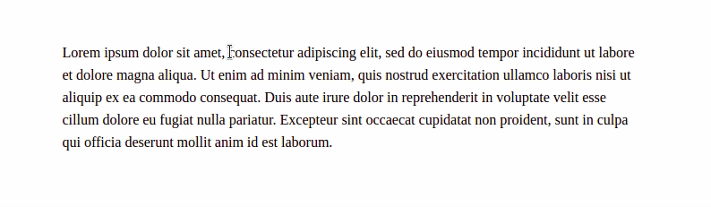

# EditorJS Tooltip Inline-tool

Tooltip for [Editor.js](https://editorjs.io).


## Notes

- Adds a tooltip as an inline-tool in Editor.js.
- Custom styles to the selected text.
- Custom tooltip location.
- Custom styles to the tooltips.

## Installation

### Install via NPM
Get the package

```shell
$ npm i --save-dev editorjs-tooltip
```

Include module at your application

```javascript
import Tooltip from 'editorjs-tooltip';
```

## Usage

Add a new Tool to the `tools` property of the Editor.js initial config.

```javascript
const editor = EditorJS({
  tools: {
    tooltip: {
      class: Tooltip,
      config: {
        location: 'left',
        highlightColor: '#FFEFD5',
        underline: true,
        backgroundColor: '#154360',
        textColor: '#FDFEFE',
        holder: 'editorId',
      }
    }
  }
});
```
Select some text, click on the tooltip button in the inline-tools bar, and type the tooltip in the input, when the key enter is pressed, the tooltip will be created.

**Note:** Use the holder field to indicate the EditorJS Id passed in the div tag, by default the holder field is 'editorjs'. 

## Config Params

| Field          | Type      | Description                     |
| -------------- | --------- | ------------------------------- |
| location          | `{location: string}` | You could choose the tooltip place(top, bottom, left, right). Default value is bottom
| highlightColor | `{ highlightColor: Hex or string }`|You could choose the background text color wrapped by the tooltip, you could pass hexadecimal colors or string colors
| underline | `{ underline: boolean }`  | You could add underline text decoration to the text wrapped by the tooltip
| backgroundColor | `{ backgroundColor: string }`  | You could choose the tooltip color, you could pass hexadecimal colors or string colors
| textColor | `{ textColor: string }`  | You could choose the tooltip text color, you could pass hexadecimal colors or string colors
| holder | `{ holder: string }`  | If your EditorJS Id passed in the Editor tag is different from 'editorjs', use the holder field.

## Output data

Selected text will be wrapped in a span tag with a cdx-tooltip class and with a data-tooltip, it contains the tooltip text.

```json
{
    "type" : "text",
    "data" : {
        "text" : "It is a text to the <span class=\"cdx-tooltip\" data-tooltip =\"tooltip\" >tooltip</span> inline-tool."
    }
}
```

## Development

**Development mode**
```shell
$ yarn build:dev
```

**Production release**
1. Create a production bundle
```shell
$ yarn build
```

2. Commit `dist/bundle.js`

**Run Linter**
The linter tool will help you by analyzing source code and fix common errors, or by following the style conventions defined.
```shell
$ yarn lint .
```

**Run tests**
```shell
$ yarn test
```

## Code of conduct
We welcome everyone to contribute. Make sure you have read the [CODE_OF_CONDUCT][coc] before.

## Contributing
For information on how to contribute, please refer to our [CONTRIBUTING][contributing] guide.

## Changelog
Features and bug fixes are listed in the [CHANGELOG][changelog] file.

## License
This library is licensed under an MIT license. See [LICENSE][license] for details.

## Acknowledgements
Made with 💙 by [kommitters Open Source](https://kommit.co)

[license]: https://github.com/kommitters/editorjs-tooltip/blob/master/LICENSE
[coc]: https://github.com/kommitters/editorjs-tooltip/blob/master/CODE_OF_CONDUCT.md
[changelog]: https://github.com/kommitters/editorjs-tooltip/blob/master/CHANGELOG.md
[contributing]: https://github.com/kommitters/editorjs-tooltip/blob/master/CONTRIBUTING.md
